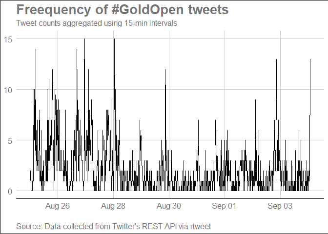
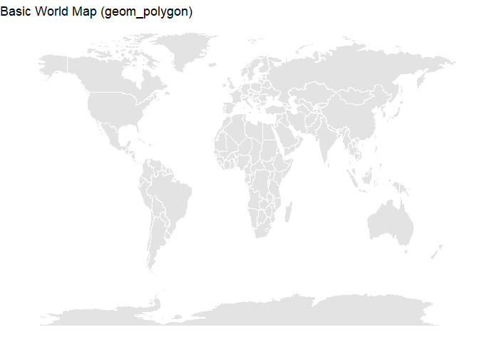
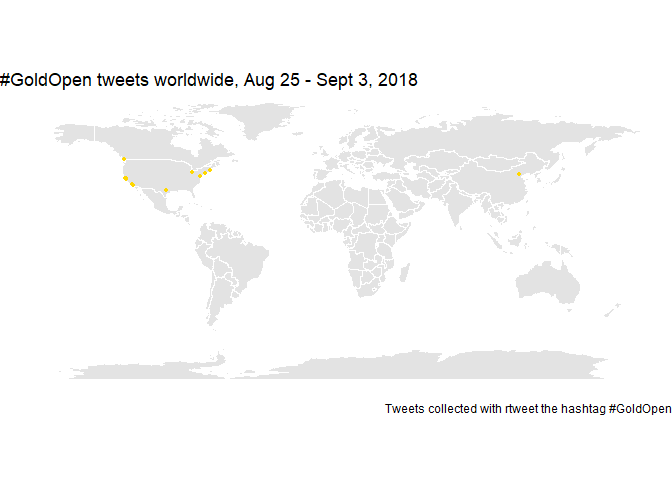
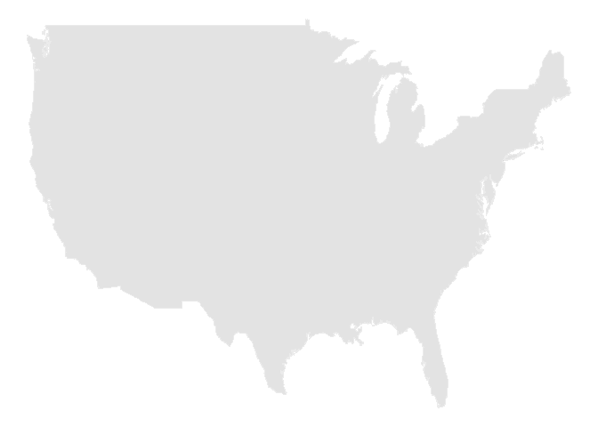
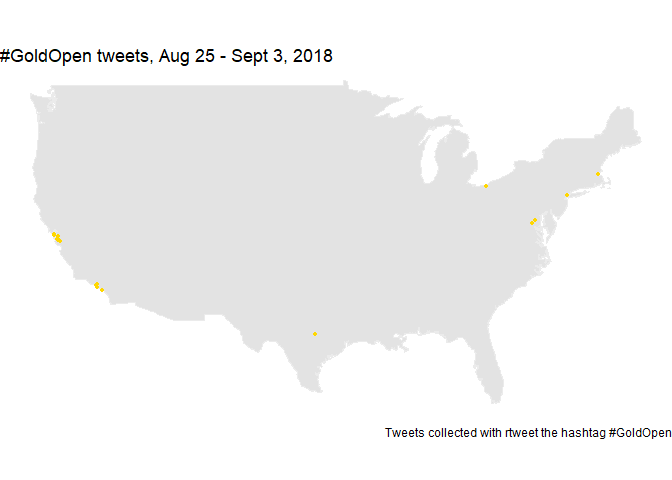

I've wanted to learn R for a while for its data analysis capabilities, so here's my first project in R based on this [Storybench tutorial](http://www.storybench.org/build-animated-map-tweets-nba-finals-r/).

When the film "Crazy Rich Asians" came out in theaters on August 15, 2018, at least dozens of celebrities, organizations, and private citizens bought out theaters to ensure a successful "#GoldOpen," as the campaign was called on Twitter. As the first major Hollywood film in 25 years with an all-Asian cast, the film is a cultural moment for Asian AMericans like myself.

I followed this [Storybench tutorial](http://www.storybench.org/build-animated-map-tweets-nba-finals-r/), which has detailed instructions on tracking tweets about the NBA finals, using #GoldOpen tweets instead. The rtweet library captures tweets from up to the last 10 days, so I was too late to see the majority of tweets when the film was released. But in my results I observed tweets from a follow-up campaign for "Searching," which stars John Cho and had a wide release on August 31, 2018.

## Setting up the Twitter app

I followed the instructions on the [rtweet website](https://rtweet.info/) to set up a Twitter app and authenticated it using the `create_token()` function as shown in the documentation.

## Setting up the R environment

Here are the packages I used to pull, analyze, and visualize the tweets.


```r
library(tidyverse)
library(rtweet)
library(ggplot2)
library(ggmap)
library(maps)
library(mapdata)
library(ggraph)
library(igraph)
library(hrbrthemes)
library(ggalt)
library(ggthemes)
```

## Let's get some tweets!

I found tweets with the hashtag #GoldOpen using the rtweet package.


```r
GoldOpen <- rtweet::search_tweets(
  "GoldOpen",
  n = 50000,
  retryonratelimit = TRUE)
```

Here's the data frame of results.


```r
#GoldOpen %>% head(10)
GoldOpen %>% dplyr::glimpse()
```

```
## Observations: 2,000
## Variables: 88
## $ user_id                 <chr> "41749339", "30219241", "27869369", "8...
## $ status_id               <chr> "1036794934760599553", "10367945940826...
## $ created_at              <dttm> 2018-09-04 01:55:49, 2018-09-04 01:54...
## $ screen_name             <chr> "petertrinh", "brianhoward33", "rileyj...
## $ text                    <chr> "\"This movie won't be successful with...
## $ source                  <chr> "Twitter for Android", "Twitter for iP...
## $ display_text_width      <dbl> 136, 136, 136, 136, 136, 267, 139, 139...
## $ reply_to_status_id      <chr> NA, NA, NA, NA, NA, "10312282359445872...
## $ reply_to_user_id        <chr> NA, NA, NA, NA, NA, "1859566374", NA, ...
## $ reply_to_screen_name    <chr> NA, NA, NA, NA, NA, "nancywyuen", NA, ...
## $ is_quote                <lgl> FALSE, FALSE, FALSE, FALSE, FALSE, FAL...
## $ is_retweet              <lgl> TRUE, TRUE, TRUE, TRUE, TRUE, FALSE, T...
## $ favorite_count          <int> 0, 0, 0, 0, 0, 52, 0, 0, 74, 0, 0, 0, ...
## $ retweet_count           <int> 11, 11, 11, 11, 11, 10, 11, 4, 27, 37,...
## $ hashtags                <list> [<"CrazyRichAsians", "GoldOpen">, <"C...
## $ symbols                 <list> [NA, NA, NA, NA, NA, NA, NA, NA, NA, ...
## $ urls_url                <list> ["hollywoodreporter.com/news/crazy-ri...
## $ urls_t.co               <list> ["https://t.co/LCcR8nEJ3i", "https://...
## $ urls_expanded_url       <list> ["https://www.hollywoodreporter.com/n...
## $ media_url               <list> [NA, NA, NA, NA, NA, "http://pbs.twim...
## $ media_t.co              <list> [NA, NA, NA, NA, NA, "https://t.co/Vc...
## $ media_expanded_url      <list> [NA, NA, NA, NA, NA, "https://twitter...
## $ media_type              <list> [NA, NA, NA, NA, NA, "photo", NA, NA,...
## $ ext_media_url           <list> [NA, NA, NA, NA, NA, <"http://pbs.twi...
## $ ext_media_t.co          <list> [NA, NA, NA, NA, NA, <"https://t.co/V...
## $ ext_media_expanded_url  <list> [NA, NA, NA, NA, NA, <"https://twitte...
## $ ext_media_type          <chr> NA, NA, NA, NA, NA, NA, NA, NA, NA, NA...
## $ mentions_user_id        <list> ["78946500", "78946500", "78946500", ...
## $ mentions_screen_name    <list> ["jennyyangtv", "jennyyangtv", "jenny...
## $ lang                    <chr> "en", "en", "en", "en", "en", "en", "e...
## $ quoted_status_id        <chr> NA, NA, NA, NA, NA, NA, NA, NA, NA, NA...
## $ quoted_text             <chr> NA, NA, NA, NA, NA, NA, NA, NA, NA, NA...
## $ quoted_created_at       <dttm> NA, NA, NA, NA, NA, NA, NA, NA, NA, N...
## $ quoted_source           <chr> NA, NA, NA, NA, NA, NA, NA, NA, NA, NA...
## $ quoted_favorite_count   <int> NA, NA, NA, NA, NA, NA, NA, NA, NA, NA...
## $ quoted_retweet_count    <int> NA, NA, NA, NA, NA, NA, NA, NA, NA, NA...
## $ quoted_user_id          <chr> NA, NA, NA, NA, NA, NA, NA, NA, NA, NA...
## $ quoted_screen_name      <chr> NA, NA, NA, NA, NA, NA, NA, NA, NA, NA...
## $ quoted_name             <chr> NA, NA, NA, NA, NA, NA, NA, NA, NA, NA...
## $ quoted_followers_count  <int> NA, NA, NA, NA, NA, NA, NA, NA, NA, NA...
## $ quoted_friends_count    <int> NA, NA, NA, NA, NA, NA, NA, NA, NA, NA...
## $ quoted_statuses_count   <int> NA, NA, NA, NA, NA, NA, NA, NA, NA, NA...
## $ quoted_location         <chr> NA, NA, NA, NA, NA, NA, NA, NA, NA, NA...
## $ quoted_description      <chr> NA, NA, NA, NA, NA, NA, NA, NA, NA, NA...
## $ quoted_verified         <lgl> NA, NA, NA, NA, NA, NA, NA, NA, NA, NA...
## $ retweet_status_id       <chr> "1036792515133825024", "10367925151338...
## $ retweet_text            <chr> "\"This movie won't be successful with...
## $ retweet_created_at      <dttm> 2018-09-04 01:46:12, 2018-09-04 01:46...
## $ retweet_source          <chr> "Twitter for Android", "Twitter for An...
## $ retweet_favorite_count  <int> 44, 44, 44, 44, 44, NA, 46, 28, NA, 13...
## $ retweet_retweet_count   <int> 11, 11, 11, 11, 11, NA, 11, 4, NA, 37,...
## $ retweet_user_id         <chr> "78946500", "78946500", "78946500", "7...
## $ retweet_screen_name     <chr> "jennyyangtv", "jennyyangtv", "jennyya...
## $ retweet_name            <chr> "Jenny Yang \U0001f472\U0001f3fc\U0001...
## $ retweet_followers_count <int> 27607, 27607, 27607, 27607, 27607, NA,...
## $ retweet_friends_count   <int> 942, 942, 942, 942, 942, NA, 615, 1467...
## $ retweet_statuses_count  <int> 24735, 24735, 24735, 24735, 24735, NA,...
## $ retweet_location        <chr> "Los Angeles, CA", "Los Angeles, CA", ...
## $ retweet_description     <chr> "comedian/writer/actor. | booking inqu...
## $ retweet_verified        <lgl> TRUE, TRUE, TRUE, TRUE, TRUE, NA, FALS...
## $ place_url               <chr> NA, NA, NA, NA, NA, NA, NA, NA, NA, NA...
## $ place_name              <chr> NA, NA, NA, NA, NA, NA, NA, NA, NA, NA...
## $ place_full_name         <chr> NA, NA, NA, NA, NA, NA, NA, NA, NA, NA...
## $ place_type              <chr> NA, NA, NA, NA, NA, NA, NA, NA, NA, NA...
## $ country                 <chr> NA, NA, NA, NA, NA, NA, NA, NA, NA, NA...
## $ country_code            <chr> NA, NA, NA, NA, NA, NA, NA, NA, NA, NA...
## $ geo_coords              <list> [<NA, NA>, <NA, NA>, <NA, NA>, <NA, N...
## $ coords_coords           <list> [<NA, NA>, <NA, NA>, <NA, NA>, <NA, N...
## $ bbox_coords             <list> [<NA, NA, NA, NA, NA, NA, NA, NA>, <N...
## $ status_url              <chr> "https://twitter.com/petertrinh/status...
## $ name                    <chr> "Peter Trinh", "Brian Howard", "Riley ...
## $ location                <chr> "Seattle,  WA", "Grambling, LA", "Stud...
## $ description             <chr> "Filmmaker | Freelance Writer | Design...
## $ url                     <chr> "https://t.co/Schlan8gOd", "https://t....
## $ protected               <lgl> FALSE, FALSE, FALSE, FALSE, FALSE, FAL...
## $ followers_count         <int> 196, 305, 8089, 92, 11335, 11335, 1133...
## $ friends_count           <int> 194, 380, 1954, 2738, 5849, 5849, 5849...
## $ listed_count            <int> 5, 3, 158, 0, 216, 216, 216, 216, 216,...
## $ statuses_count          <int> 3862, 8514, 29704, 5261, 15671, 15671,...
## $ favourites_count        <int> 1471, 4527, 64209, 5222, 20756, 20756,...
## $ account_created_at      <dttm> 2009-05-22 04:14:25, 2009-04-10 13:54...
## $ verified                <lgl> FALSE, FALSE, TRUE, FALSE, TRUE, TRUE,...
## $ profile_url             <chr> "https://t.co/Schlan8gOd", "https://t....
## $ profile_expanded_url    <chr> "http://www.petertrinh.com", "http://w...
## $ account_lang            <chr> "en", "en", "en", "en", "en", "en", "e...
## $ profile_banner_url      <chr> "https://pbs.twimg.com/profile_banners...
## $ profile_background_url  <chr> "http://abs.twimg.com/images/themes/th...
## $ profile_image_url       <chr> "http://pbs.twimg.com/profile_images/9...
```


The data frame has 2,000 observations and 88 variables. Let's see which variables from the query are available when I use the `users_data()` function.


```r
tibble::as_tibble(
  base::intersect(x = base::names(GoldOpen), 
                                  y = base::names(rtweet::users_data(GoldOpen))))
```

```
## # A tibble: 20 x 1
##    value                 
##    <chr>                 
##  1 user_id               
##  2 screen_name           
##  3 name                  
##  4 location              
##  5 description           
##  6 url                   
##  7 protected             
##  8 followers_count       
##  9 friends_count         
## 10 listed_count          
## 11 statuses_count        
## 12 favourites_count      
## 13 account_created_at    
## 14 verified              
## 15 profile_url           
## 16 profile_expanded_url  
## 17 account_lang          
## 18 profile_banner_url    
## 19 profile_background_url
## 20 profile_image_url
```

I can store those results when I look at the user data of the #GoldOpen query in a new data frame.


```r
UsersGoldOpen <- rtweet::users_data(GoldOpen)
UsersGoldOpen %>% head(10)
```

```
## # A tibble: 10 x 20
##    user_id screen_name name  location description url   protected
##    <chr>   <chr>       <chr> <chr>    <chr>       <chr> <lgl>    
##  1 417493~ petertrinh  Pete~ Seattle~ Filmmaker ~ http~ FALSE    
##  2 302192~ brianhowar~ Bria~ Grambli~ "Former at~ http~ FALSE    
##  3 278693~ rileyjsilv~ Rile~ Studio ~ "Comedian ~ http~ FALSE    
##  4 862399~ GeneralZod~ John  Wiscons~ Veteran, a~ <NA>  FALSE    
##  5 185956~ nancywyuen  Nanc~ San Gab~ "Sociology~ http~ FALSE    
##  6 185956~ nancywyuen  Nanc~ San Gab~ "Sociology~ http~ FALSE    
##  7 185956~ nancywyuen  Nanc~ San Gab~ "Sociology~ http~ FALSE    
##  8 185956~ nancywyuen  Nanc~ San Gab~ "Sociology~ http~ FALSE    
##  9 185956~ nancywyuen  Nanc~ San Gab~ "Sociology~ http~ FALSE    
## 10 185956~ nancywyuen  Nanc~ San Gab~ "Sociology~ http~ FALSE    
## # ... with 13 more variables: followers_count <int>, friends_count <int>,
## #   listed_count <int>, statuses_count <int>, favourites_count <int>,
## #   account_created_at <dttm>, verified <lgl>, profile_url <chr>,
## #   profile_expanded_url <chr>, account_lang <chr>,
## #   profile_banner_url <chr>, profile_background_url <chr>,
## #   profile_image_url <chr>
```

Now that I've looked at user data, I move on to tweet data.


```r
tibble::as_tibble(
  intersect(x = base::names(GoldOpen), 
                                  y = base::names(rtweet::tweets_data(GoldOpen))))
```

```
## # A tibble: 68 x 1
##    value               
##    <chr>               
##  1 user_id             
##  2 status_id           
##  3 created_at          
##  4 screen_name         
##  5 text                
##  6 source              
##  7 display_text_width  
##  8 reply_to_status_id  
##  9 reply_to_user_id    
## 10 reply_to_screen_name
## # ... with 58 more rows
```

Again, I can save the results of running that function on the GoldOpen query to a dataframe.


```r
TweetsGoldOpen <- rtweet::tweets_data(GoldOpen)
```

Here are the contents of the first 10 tweets stored in the `text` variable.


```r
GoldOpen %>%
    dplyr::select(text) %>%
    utils::head(10)
```

```
## # A tibble: 10 x 1
##    text                                                                    
##    <chr>                                                                   
##  1 "\"This movie won't be successful without a white lead.\" - They Said\n~
##  2 "\"This movie won't be successful without a white lead.\" - They Said\n~
##  3 "\"This movie won't be successful without a white lead.\" - They Said\n~
##  4 "\"This movie won't be successful without a white lead.\" - They Said\n~
##  5 "\"This movie won't be successful without a white lead.\" - They Said\n~
##  6 Saw #Searching last night and it is EVERYTHING! Mystery, tears, laughte~
##  7 I can’t buy out whole auditoriums for @SearchingMovie, but I’m willing ~
##  8 I interviewed CHRIS PANG and REMY HII on their roles in #CrazyRichAsian~
##  9 "Please vote for #PanelPicker \"Crazy Rich Wakanda\" today (voting clos~
## 10 What a time to be alive where an all Asian cast in a mainstream studio ~
```

## Construct a timeline of tweets

I can plot tweets over time using the `rtweet::ts_plot()` function and a few other packages to tweak the visuals.


```r
gg_ts_plot <- GoldOpen %>%
    rtweet::ts_plot(., by = "15 minutes") +
    ggthemes::theme_gdocs() +
    ggplot2::theme(plot.title =
        ggplot2::element_text(face = "bold")) +
    ggplot2::labs(
        x = NULL,
        y = NULL,
        title = "Freequency of #GoldOpen tweets",
        subtitle = "Tweet counts aggregated using 15-min intervals",
        caption = "\nSource: Data collected from Twitter's REST API via rtweet")
```

Here's the plot.


```r
gg_ts_plot
```

<!-- -->

## Adding geographic information

Now that I've seen time information, let's add latitude and longitutde to the tweet data.


```r
GoldOpenLoc <- rtweet::lat_lng(GoldOpen)
```

I can verify the function added lat and lng variables to the GoldOpen data frame.


```r
GoldOpenLoc %>% names() %>% tail(2)
```

```
## [1] "lat" "lng"
```

Let's see how many tweets have latitude and longitude information.


```r
GoldOpenLoc %>% dplyr::distinct(lng) %>% base::nrow()
```

```
## [1] 26
```

Only 26 of the 2,000 tweets have the geographic information, but we can map the results we have. Let's rename lng to long, which will be helpful later on.


```r
GoldOpenLoc <- GoldOpenLoc %>% dplyr::rename(long = lng)
```

## Creating a world map of tweets

I first need to get the data for a world map.


```r
World <- ggplot2::map_data("world")
World %>% head(10)
```

```
##         long      lat group order region subregion
## 1  -69.89912 12.45200     1     1  Aruba      <NA>
## 2  -69.89571 12.42300     1     2  Aruba      <NA>
## 3  -69.94219 12.43853     1     3  Aruba      <NA>
## 4  -70.00415 12.50049     1     4  Aruba      <NA>
## 5  -70.06612 12.54697     1     5  Aruba      <NA>
## 6  -70.05088 12.59707     1     6  Aruba      <NA>
## 7  -70.03511 12.61411     1     7  Aruba      <NA>
## 8  -69.97314 12.56763     1     8  Aruba      <NA>
## 9  -69.91181 12.48047     1     9  Aruba      <NA>
## 10 -69.89912 12.45200     1    10  Aruba      <NA>
```

This next function will create a map using that data.


```r
ggWorldMap <- ggplot2::ggplot() + 
    ggplot2::geom_polygon(data = World,
        aes(x = long,
        y = lat,
        group = group),
        fill = "grey82",
        color = "white",
        alpha = 0.6)

ggWorldMap +
    ggplot2::theme_void() +
    ggplot2::labs(title = "Basic World Map (geom_polygon)")
```

<!-- -->

I can layer the tweet data on top of the world map.


```r
gg_Merc_title <- "#GoldOpen tweets worldwide, Aug 25 - Sept 3, 2018"
gg_Merc_cap <- "Tweets collected with rtweet the hashtag #GoldOpen"
gg_mercator_goldopen <- ggWorldMap +
    ggplot2::coord_quickmap() +
    ggplot2::geom_point(data = GoldOpenLoc,
                        aes(x = long, y = lat),
                        size = 1,
                        color = "gold") +
    ggplot2::labs(title = gg_Merc_title,
        caption = gg_Merc_cap) +   
    ggplot2::theme_void()
```

Here's the map with the tweet data.


```r
gg_mercator_goldopen
```

<!-- -->

I now want to zoom in on just tweets from the U.S. The code is almost exactly the same as above. Here is the blank map of the U.S.


```r
USmap <- ggplot2::map_data("usa")

ggUSMap <- ggplot2::ggplot() +
    ggplot2::geom_polygon(data = USmap,
        aes(x = long,
        y = lat,
        group = group),
        fill = "grey82",
        color = "grey92",
        alpha = 0.6)
        
ggUSMap + ggplot2::theme_void()
```

<!-- -->

I can filter the data down to just tweets from the U.S.


```r
USfilter <- GoldOpenLoc %>% filter(country == "United States")

USfilter %>% head(10)
```

```
## # A tibble: 10 x 90
##    user_id status_id created_at          screen_name text  source
##    <chr>   <chr>     <dttm>              <chr>       <chr> <chr> 
##  1 616246~ 10363652~ 2018-09-02 21:28:14 OCAClevela~ Toni~ Twitt~
##  2 351470~ 10367840~ 2018-09-04 01:12:38 templefare~ Four~ Insta~
##  3 696454~ 10363408~ 2018-09-02 19:51:31 nice1dave   "Con~ Twitt~
##  4 696454~ 10367512~ 2018-09-03 23:02:20 nice1dave   #Cra~ Twitt~
##  5 160569~ 10353872~ 2018-08-31 04:42:18 BostonAAFi~ Sold~ Insta~
##  6 715229~ 10366018~ 2018-09-03 13:08:38 FuriiousWa~ Enjo~ Twitt~
##  7 289357~ 10353292~ 2018-08-31 00:51:47 briflys     Tear~ Twitt~
##  8 468074~ 10365340~ 2018-09-03 08:39:05 ShuangHuAus Just~ Twitt~
##  9 685006~ 10339447~ 2018-08-27 05:10:02 laarnid1    #Asi~ Twitt~
## 10 685006~ 10334213~ 2018-08-25 18:30:23 laarnid1    LA/O~ Twitt~
## # ... with 84 more variables: display_text_width <dbl>,
## #   reply_to_status_id <chr>, reply_to_user_id <chr>,
## #   reply_to_screen_name <chr>, is_quote <lgl>, is_retweet <lgl>,
## #   favorite_count <int>, retweet_count <int>, hashtags <list>,
## #   symbols <list>, urls_url <list>, urls_t.co <list>,
## #   urls_expanded_url <list>, media_url <list>, media_t.co <list>,
## #   media_expanded_url <list>, media_type <list>, ext_media_url <list>,
## #   ext_media_t.co <list>, ext_media_expanded_url <list>,
## #   ext_media_type <chr>, mentions_user_id <list>,
## #   mentions_screen_name <list>, lang <chr>, quoted_status_id <chr>,
## #   quoted_text <chr>, quoted_created_at <dttm>, quoted_source <chr>,
## #   quoted_favorite_count <int>, quoted_retweet_count <int>,
## #   quoted_user_id <chr>, quoted_screen_name <chr>, quoted_name <chr>,
## #   quoted_followers_count <int>, quoted_friends_count <int>,
## #   quoted_statuses_count <int>, quoted_location <chr>,
## #   quoted_description <chr>, quoted_verified <lgl>,
## #   retweet_status_id <chr>, retweet_text <chr>,
## #   retweet_created_at <dttm>, retweet_source <chr>,
## #   retweet_favorite_count <int>, retweet_retweet_count <int>,
## #   retweet_user_id <chr>, retweet_screen_name <chr>, retweet_name <chr>,
## #   retweet_followers_count <int>, retweet_friends_count <int>,
## #   retweet_statuses_count <int>, retweet_location <chr>,
## #   retweet_description <chr>, retweet_verified <lgl>, place_url <chr>,
## #   place_name <chr>, place_full_name <chr>, place_type <chr>,
## #   country <chr>, country_code <chr>, geo_coords <list>,
## #   coords_coords <list>, bbox_coords <list>, status_url <chr>,
## #   name <chr>, location <chr>, description <chr>, url <chr>,
## #   protected <lgl>, followers_count <int>, friends_count <int>,
## #   listed_count <int>, statuses_count <int>, favourites_count <int>,
## #   account_created_at <dttm>, verified <lgl>, profile_url <chr>,
## #   profile_expanded_url <chr>, account_lang <chr>,
## #   profile_banner_url <chr>, profile_background_url <chr>,
## #   profile_image_url <chr>, lat <dbl>, long <dbl>
```

Then I put these filtered tweets onto the map.


```r
gg_USMerc_title <- "#GoldOpen tweets, Aug 25 - Sept 3, 2018"

gg_USMerc_cap <- "Tweets collected with rtweet the hashtag #GoldOpen"

gg_usmercator_goldopen <- ggUSMap +
    ggplot2::coord_quickmap() +
    ggplot2::geom_point(data = USfilter,
        aes(x = long, y = lat),
        size = 1.0,
        color = "gold") +
    ggplot2::labs(title = gg_USMerc_title,
        caption = gg_USMerc_cap) +
    ggplot2::theme_void()
    
gg_usmercator_goldopen
```

<!-- -->

There's not much I can extrapolate from such a small sample size, but I do see the few tweets I did get concentrated in urban coastal areas (SF, LA, NYC), where many Asians live.
